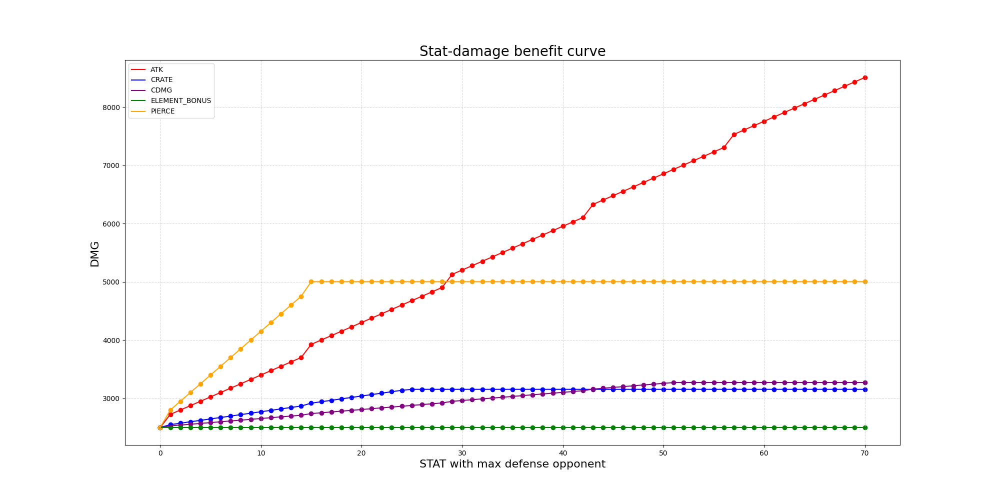
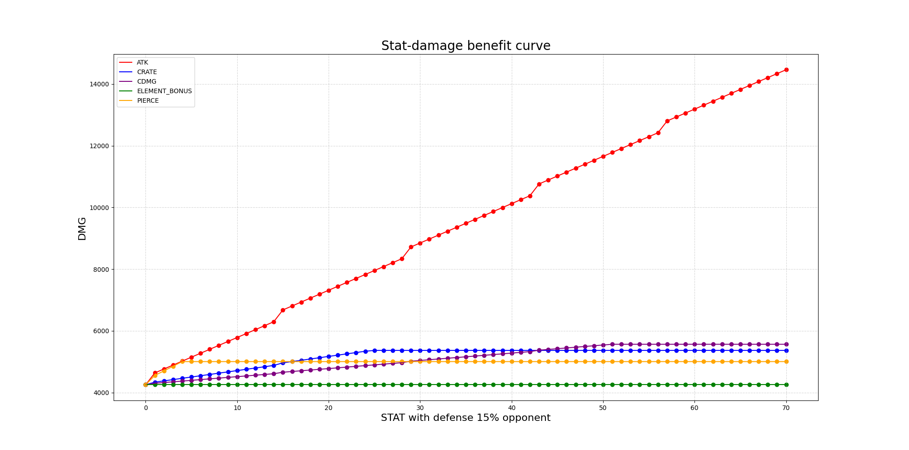
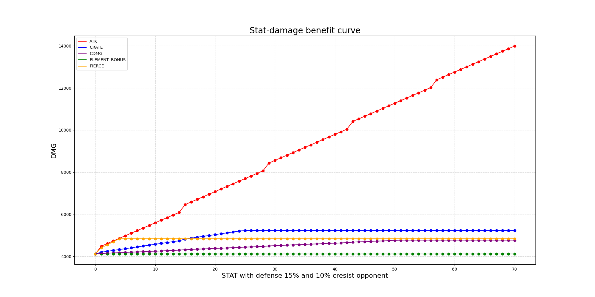
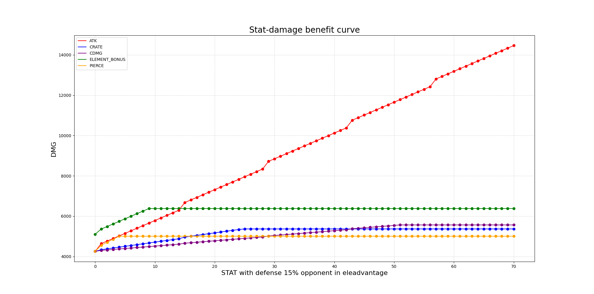
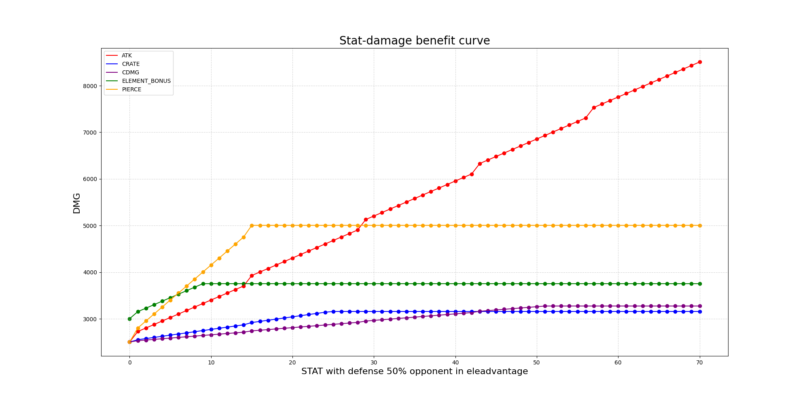
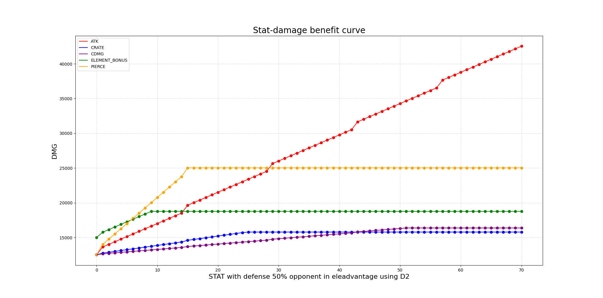

## SGM stat-damage benefit curve graph generator

### Brief

This project is motivated by the desire of seeing how move stats affect the final damage.

Limited by my knowledge and efforts currently it is very cringe now that only involves offense stats, but works to my interest.

Feel free to give PR, leave comments and contact me in github and discord sgm server ( my discord name is `Rax` ) for the mistakes( especially damage formula ), optimizations or decorations you find and raise. 

### Result Exhibition













### Usage

This program requires `python3` and `matplotlib` and `numpy` module.

To  run:

```
python3 main.py
```

Change the variables' values in `src/main.py` to  generate very different results.

### Todo

- add gui to change values
- add debuffs' influence
- add move selection part
- more flexible and high efficient code format to provide more functions

### Ref

Many thanks to resources provider listed below and skullgirls discord server sgm-gameplay channel pinned messages:

fighter basic stats: https://krazete.github.io/sgm/index.html

move damage stats: https://docs.google.com/spreadsheets/d/1HnPKDCrCi73n0lppFs_le7-Z_jJKU8ZZsq-5d7fhj-g/edit#gid=626943306

move calculation: https://docs.google.com/spreadsheets/d/1JlVUjz67OnG3b_lO4MHFqo9uAD3kUZBNlw2Niy5_0tc/edit#gid=0